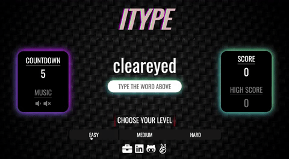

# Summary & Functionality
iType is a speed typing game that allows players to practice their typing skills and accuracy. The main screen will display the level of difficulty that the user may choose from (Easy, Medium, Hard). Once the player selects a level, the screen will then render the first word and will begin once the player starts typing.

Depending on the level, the player will then have a certain amount of time to type as many words as possible, where the final score is determined by the correctly spelled words.

# Technologies
- ## JavaScript
- ## HTML / CSS
- ## Word API


# Demo 


# Gameplay
To begin the game, the player may choose a level of difficulty under 'Choose your level'. The range of difficulty spans from Warmup (Easy), Warmed-Up (Medium), and Wordsmith (Hard). Depending on the chosen level, the countdown will vary from 5 to 1 second(s), and update respectively. 

``` 
#index.html

<div class='difficulty-section'>
    <h1>Choose your level</h1>
    <div class='select-difficulty'>
        <button class='level-btn' onclick="playBtnSound(); changeLevel(5);" class="level-btn">Warmup</button>
        <button class='level-btn' onclick="playBtnSound(); changeLevel(3);" class='level-btn'>Warmed-Up</button>
        <button class='level-btn' onclick="playBtnSound(); changeLevel(1);" class='level-btn'>Wordsmith</button>    
    </div>
</div>

#main.js 

function changeLevel(level) {
    currentLevel = level;
    timeDisplay.innerHTML = currentLevel;
}
```
Once the user clicks on a level button, the changeLevel function is invoked. By utilizing DOM manipulation, the timeDisplay's innerHTML element is set to the chosen level, which then gets updated in the game. 

After the user selects their level of choice, they may click on 'Begin typing!' then proceed to type the given word. Since the first word can be completed at any time, it does not count towards their score. Once the first word is typed, the game has now begun and the timer starts to count down. 

```
#main.js 

const wordInput = document.getElementById('word-input');
const currentWord = document.getElementById('current-word';
const scoreDisplay = document.getElementById('score');
const highscoreDisplay = document.getElementById('high-score');
const timeDisplay = document.getElementById('time');
const message = document.getElementById('message');

function startMatch() {
    if (matchWords()) {
        isPlaying = true;
        time = currentLevel + 1;
        changeWord(words);
        wordInput.value = '';
        score++;
    }
    score === -1 ? scoreDisplay.innerHTML = 0 : scoreDisplay.innerHTML = score;
    if (score > highScore) highScore = score;
    highscoreDisplay.innerHTML = highScore;
}

function matchWords() {
    if (wordInput.value.toLowerCase() === currentWord.innerHTML) {
        clearInterval(timer);
        timer = setInterval(countdown, 1000);
        playLevelUp();
        message.innerHTML = '';
        return true;
    } else {
        return false;
    }
}
```
The game's word matching logic is centered around the player's keystrokes and word input. If the current wordInput matches the currentWord being displayed, the matchWords function resets the countdown timer, invokes the audio playLevelUp object, and returns a true boolean value. 

# Random Word API Implementation

During the the developmennt of this game, I needed to figure out a way to create a dynamic display of words instead of hard coding several words into the code. After researching different word API's and how to implement them, I came across a useful API which best suited the requirements for the game. Through this approach, I was able to fetch random words by using an AJAX call to the API. From there, I retrieved the list of words, implemented a random word selector function, and updated the currentWord element with the selected word.

```
function init() {
    timeDisplay.innerHTML = time;

    words = fetch('https://random-word-api.herokuapp.com/word?number=100')
        .then(response => response.json())
        .then(data => words = data) 
        .then(data => data.forEach(word => currentWord.innerHTML = word))

    showWord(words);
    wordInput.addEventListener('input', startMatch);
    setInterval(gameOver, 50);
}
```


# MVP List 
1. User's are able to select the level of difficulty.

2. User's are presented with an updating and final score during gameplay.

3. Appealing visuals, stylings and sounds. User's will be able to see if they mispell any words with specific highlighting and sound indicators.

4. Scoreboard that holds record scores of previous and current players.

# Implementation Timeline 

Day 1: Map out skelenton of the code, research any documentation on how to implement sound, pick out color scheme/theme.

Day 2: Begin the gameplay functionality and logic, as well as any light styling to get a better visual of the game.

Day 3: Research different API's to fetch words or quotes and implement them into the code. Finalize visuals, stylings, and sounds.
